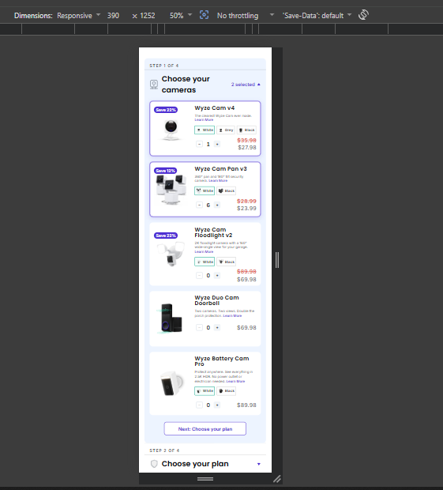
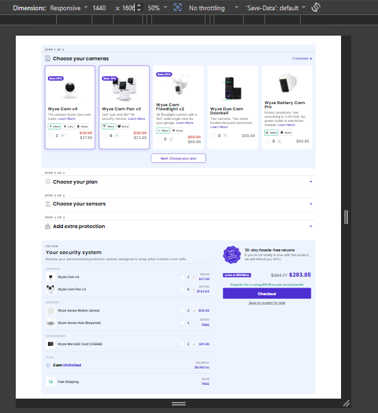
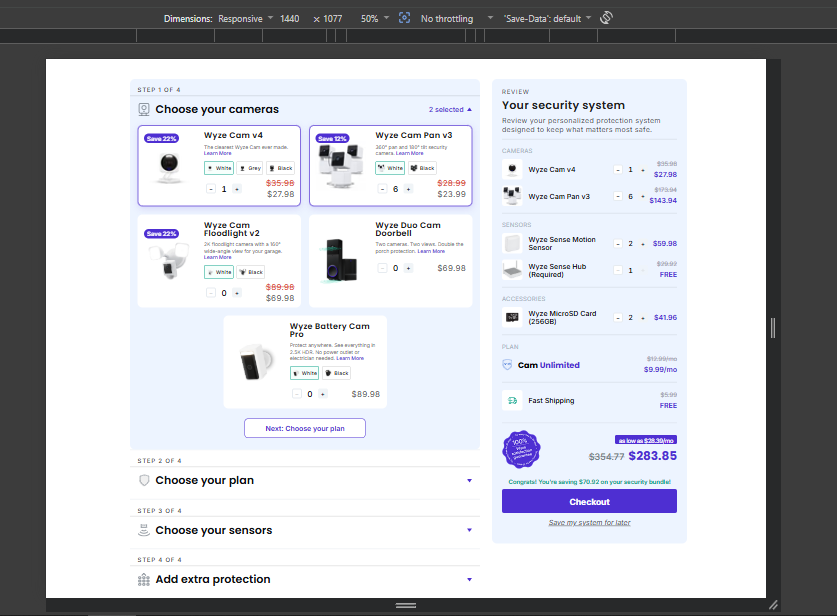

# Bundle Builder

A data-driven, multi-step **bundle builder** with a live review panel — a React prototype of
the Wyze-style home-security system design.

- **Left:** a 4-step accordion (cameras → plan → sensors → extra protection) with product cards
  (badge, image, variant chips, quantity stepper, pricing).
- **Right:** a live "Your security system" summary that recalculates as you configure.

## Tech stack

React 19 · TypeScript · Vite · Tailwind CSS v4 · Zustand · Motion (animations). Data is a single
local JSON file (`src/data/catalog.json`) — no backend needed.

## Getting started

```bash
npm install
npm run dev       # start the dev server (prints a local URL)
```

```bash
npm run build     # type-check + production build
npm run preview   # preview the production build
npm run lint      # eslint
npm test          # vitest unit suite
```

> Runs correctly from a clean clone even before adding photos — missing images fall back to a
> neutral placeholder. To add artwork, drop files into `public/` and point a product's `image`
> (or a variant's `image`) in `catalog.json` at it.

## Architecture

```
src/
  data/catalog.json   Single source of truth: steps, products, variants, seed state
  types/              Domain types
  lib/                Pure helpers: pricing, lineItems, format, storage, catalog, cn
  store/              Zustand store + memoized derived selector hooks
  components/
    ui/               Primitives (Icon, Chevron, QuantityStepper, PriceTag, …)
    builder/          Left column (Builder, Step, ProductCard, VariantSelector)
    review/           Right column (ReviewPanel, ReviewLine, SummaryRow, SummaryFooter, …)
  App.tsx             Two-column responsive shell
```

- **State:** selections are keyed `productId` or `productId:variantId`, so per-variant
  quantities and card ↔ review stepper sync fall out naturally. All derived data (line items,
  totals, counts) is computed in selectors — never stored.
- **Logic is pure & tested:** pricing and line-item derivation live in `lib/` with Vitest tests.
- **Styling:** colours are design tokens in the `@theme` block of `src/index.css`, referenced
  via Tailwind classes (`bg-primary`, `text-savings`, …).
- **Persistence:** *Save my system for later* writes to `localStorage`; on reload the app
  restores it, otherwise it loads the seeded design state.

## Notes

- Prices are **computed** (`unit × qty`); seed values are calibrated so the initial bundle
  matches the design exactly — **total $187.89 · was $238.81 · save $50.92** (asserted in tests).
- The Figma's Pan v3 card price is internally inconsistent with its review line; one consistent
  unit price is used so the grand total is correct.
- Bonus not done: serving the catalog from a backend API (local JSON is used instead).
-----
preview :-https://bundle-bilder.vercel.app/
-----



